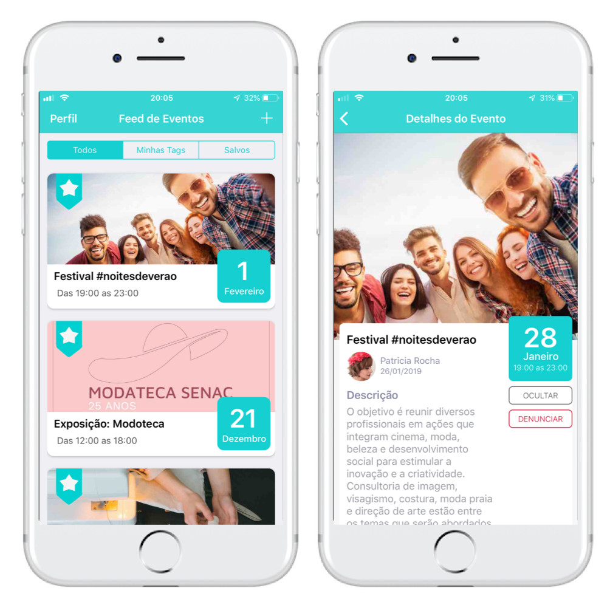

# Eventou

The goal of this project is to provide an easy-to-use platform for sharing **academic events** and **experiences**. Users may add their own events and see the ones their colleagues have added. Tags are available in order to filter out content you aren't interested in and help you focus on the events you don't want to miss out. 

Eventou is currently **available on the App Store**, you can download it [here](https://itunes.apple.com/br/app/eventou/id1439709871?l=en&mt=8).

If you want to build the project yourself, you must create a **Firebase project** and integrate it into the app. Instructions can be found in the [Google Firebase Documentation](https://firebase.google.com/docs/ios/setup).

## What I’ve Learned
- Fetching data from Firebase
- Using a NoSQL database for data storage
- Login & Sign Up with Firebase Authentication
- How to use Collection Views and Custom Cells in Swift

## Requirements
- iOS 11+
- iPhone 6+

## Project Information
- Created: 10/2018
- Updated: 06/2019
- Developers: Bruno Rocca, Lucas Pelinzon, Michelle Kamijo & Patrícia Rocha
